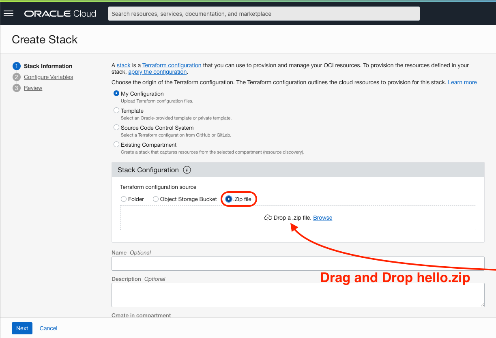

# OCI Resource Manager Hello World

This project is a simple use case for [OCI Resource Manager](https://docs.oracle.com/en-us/iaas/Content/ResourceManager/Concepts/resourcemanager.htm).

It will create a VCN by importing a zip file with the following files:

- `schema.yaml`
- `provider.tf`
- `vcn.tf`

## How To

After clone the repository, run the `zipper.sh` script that will zip the files.

You can go to OCI Web console.

Go to **Menu** > **Developer Services** > **Resource Manager** > **Stacks**.

Click **Create Stack**.

Select `.zip` and drag and drop `hello.zip`.

Click next and you can apply the stack.
